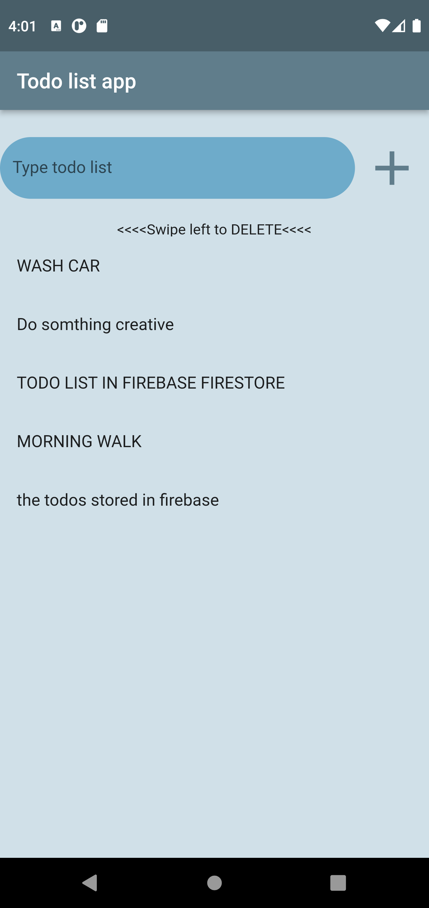

# TODO LIST app

My first Flutter and Firebase Create, Read, Delete app

## Getting Started
Run this project by following instructions below
### In command line write
$ pub get 
$flutter run

# Sample screenshot

# You can delete the list by swiping left
